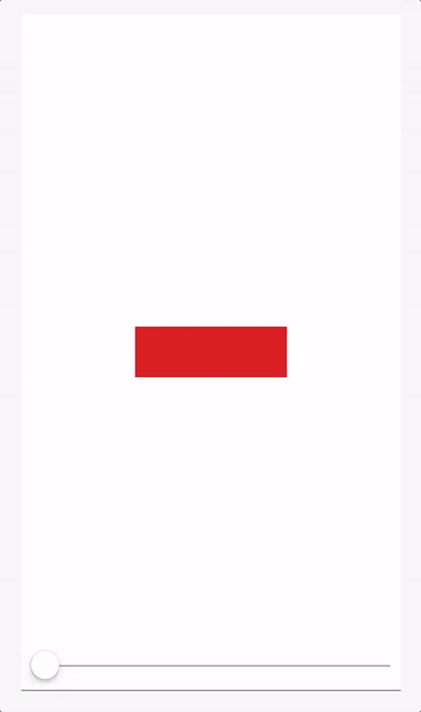
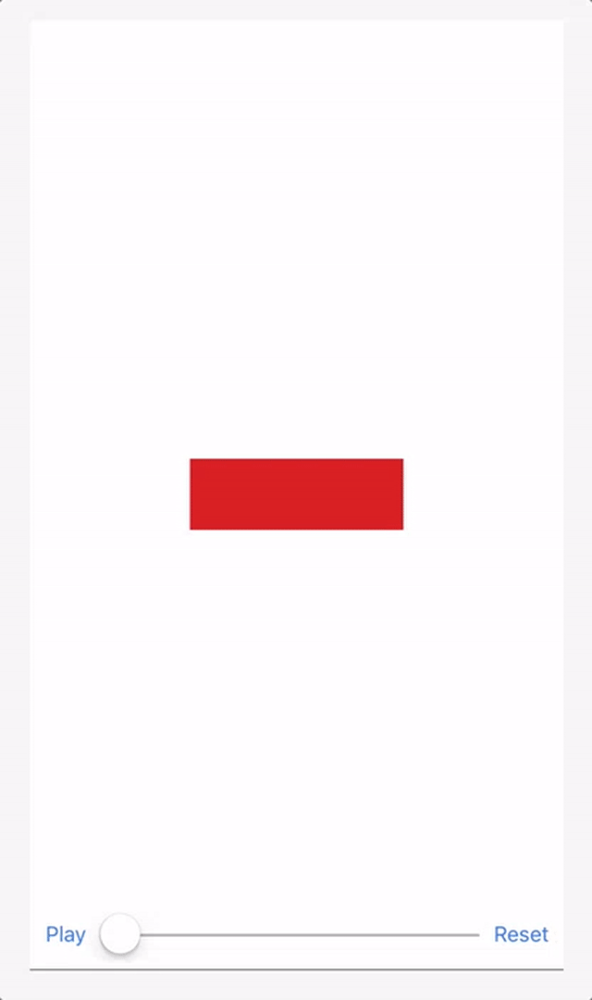
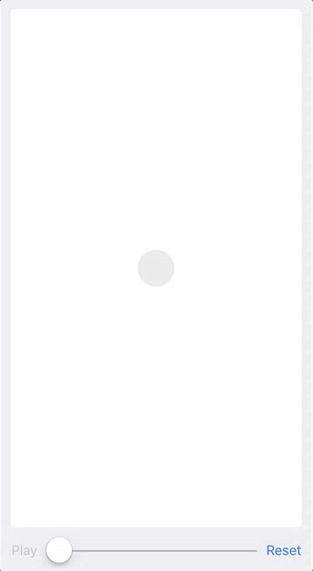

# Animation Playground Scrubber 🎚

This is a playground set up to explore, debug, and refine animations made using
`UIViewPropertyAnimator`.

The playground includes `ScrubContainerView` a simple UIView subclass that
exposes an `animator` property, and adds a `UISlider` control so you can easily
scrub through your animation interpolation.

Here's a simple example animating the size, color, and rotation of a view:

````Swift
import UIKit
import PlaygroundSupport

let container = ScrubContainerView()
PlaygroundPage.current.liveView = container

// set up views to animate
let square = UIView()
container.addSubview(square)
square.center = container.center
square.transform = .identity
square.bounds.size = CGSize(width: 150, height: 50)
square.backgroundColor = .red

// provide the container the animator to scrub
container.animator = {

    let animator = UIViewPropertyAnimator(duration: 2.5, curve: .easeInOut)

    animator.addAnimations {
        square.transform = CGAffineTransform(rotationAngle: CGFloat.pi/2)
        square.bounds.size = CGSize(width: 50, height: 150)
        square.backgroundColor = .blue
    }

    return animator
}
````

Dragging the `UISlider` lets you examine the animation at any intermediate step.



`ScrubContainerView` also exposes a closure named `startState`. This closure
defines the state of properties at the start of an animation:

````Swift
container.startState = {
    square.transform = .identity
    square.bounds.size = CGSize(width: 150, height: 50)
    square.backgroundColor = .red
}
````

When this closure is defined, `ScrubContainerView` adds buttons to play the
animation with it's default timing curve, and a reset button to return animation
to its start state after scrubbing.



Along with this simple example, the playground also [includes an example](blob/master/source/Animation.playground/Pages/Keyframe%20example.xcplaygroundpage/Contents.swift)
where a series 4 steps are chained together using keyframes to show how more
complex multi-step animations can be built.



## Roadmap
- [x] UISlider to scrub animations
- [x] Button to play animation with default timing curve and duration
- [ ] Initializers for different device sizes

## Requirements

- Swift 3.0

## Author

Made with :heart: by [@permakittens](http://twitter.com/permakittens)

## Contributing

Feedback, or contributions for bug fixing or improvements are welcome. Feel free to submit a pull request or open an issue.

## License

MIT
